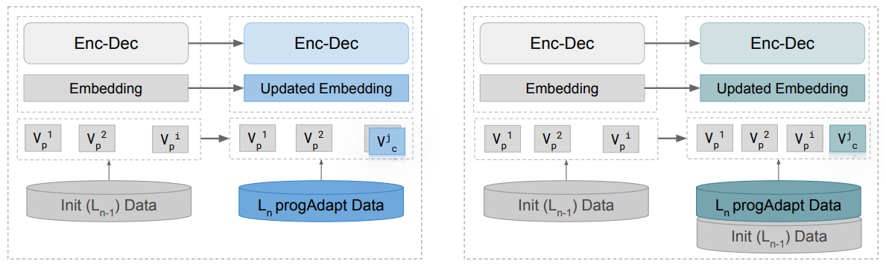
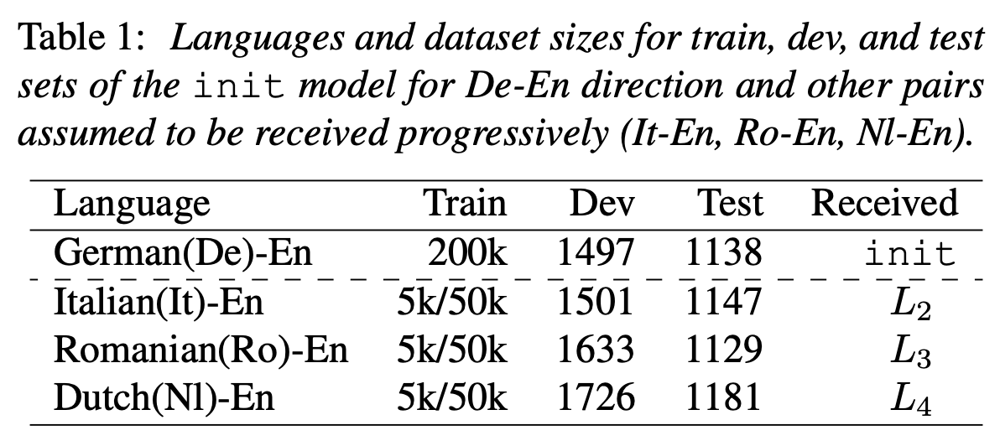
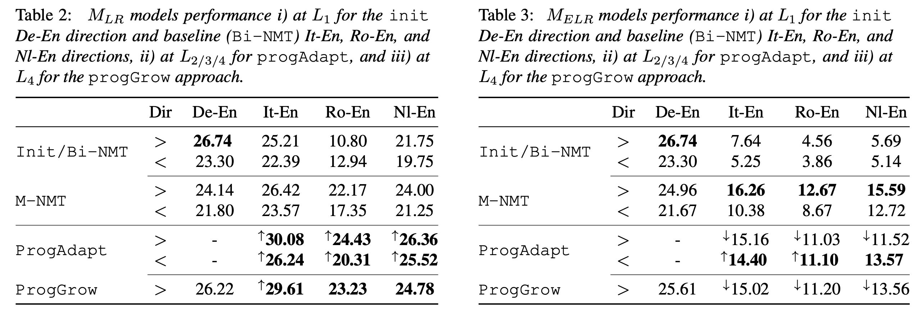

# Research Thesis :mortar_board:

Repositório com artefatos de pesquisa para tese do mestrado em Informática do PPGI (Programa de Pós Graduação em Informática) da Universidade Federal da Paraíba.

## Papers :books:

2020 | Exploring Benefits of Transfer Learning in Neural Machine Translation | Tom Kocmi | arXiv | [`PDF`](https://arxiv.org/pdf/2001.01622.pdf)

2020 | Benchmark and Survey of Automated Machine Learning Frameworks | Marc-Andre Zoller, et al. | arXiv | [`PDF`](https://arxiv.org/pdf/1904.12054.pdf)

2019 | Transfer Learning across Languages from Someone Else’s NMT Model | Tom Kocmi, et al. | arXiv | [`PDF`](https://arxiv.org/pdf/1909.10955.pdf)

2019 | AutoML: A Survey of the State-of-the-Art | Xin He, et al. | arXiv | [`PDF`](https://arxiv.org/pdf/1908.00709.pdf)

2019 | Pay Less Attention With Lightweight And Dynamic Convolutions | Felix Wu, et al. | arXiv | [`PDF`](https://arxiv.org/pdf/1901.10430.pdf)

2019 | Multi-Round Transfer Learning for Low-Resource NMT Using Multiple High-Resource Languages | Yang Liu, et al. | ACM | [`PDF`](https://dl.acm.org/doi/abs/10.1145/3314945)

2019 | Hierarchical Transfer Learning Architecture for Low-Resource Neural Machine Translation | Gongxu Luo, et al. | IEEE | [`PDF`](https://ieeexplore.ieee.org/stamp/stamp.jsp?tp=&arnumber=8805098)

2018 | Transfer Learning in Multilingual Neural Machine Translation with Dynamic Vocabulary | Surafel M. Lakew, et al. | arXiv | [`PDF`](https://arxiv.org/pdf/1811.01137.pdf)

2018 | Twitter Sentiment Analysis using Dynamic Vocabulary | Hrithik Katiyar, et al. | IEEE | [`PDF`](https://ieeexplore.ieee.org/document/8722407)

2017 | Translating Low-Resource Languages by Vocabulary Adaptation from Close Counterparts | Qun Liu, et al. | ACM | [`PDF`](https://dl.acm.org/doi/abs/10.1145/3099556)

2017 | Convolutional Sequence to Sequence Learning | Jonas Gehring, et al. | arXiv | [`PDF`](https://arxiv.org/pdf/1705.03122.pdf)

2017 | Neural Response Generation with Dynamic Vocabularies | Yu Wu, et al. | arXiv | [`PDF`](https://arxiv.org/pdf/1711.11191.pdf)

2017 | A Comparative Study of Word Embeddings for Reading Comprehension | Bhuwan Dhingra, et al. | arXiv | [`PDF`](https://arxiv.org/pdf/1703.00993.pdf)

2017 | Attention Is All You Need | Ashish Vaswani, et al. | arXiv | [`PDF`](https://arxiv.org/pdf/1706.03762.pdf)

2016 | Text Understanding from Scratch | Xiang Zhang, et al. | arXiv | [`PDF`](https://arxiv.org/pdf/1502.01710.pdf)

2016 | Google's Neural Machine Translation System: Bridging the Gap between Human and Machine Translation | Yonghui Wu, et al. | arXiv | [`PDF`](https://arxiv.org/pdf/1609.08144.pdf)

2015 | How to Generate a Good Word Embedding? | Siwei Lai, et al. | arXiv | [`PDF`](https://arxiv.org/pdf/1507.05523.pdf)

2015 | Transfer Learning for Bilingual Content Classification | Qian Sun, et al. | ACM | [`PDF`](https://dl.acm.org/doi/abs/10.1145/2783258.2788575)

## Repositories :octocat:

2020 | Awesome AutoML Papers | @hibayesian | 2.3k | [`GitHub`](https://github.com/hibayesian/awesome-automl-papers)

2020 | Auptimizer | @LGE-ARC-AdvancedAI | 133 | [`GitHub`](https://github.com/LGE-ARC-AdvancedAI/auptimizer)

2020 | TPOT | @EpistasisLab | 6.9k | [`GitHub`](https://github.com/EpistasisLab/tpot)

## Analysis Papers :nerd_face:

Nesse documento iremos abordar 4 (quatro) artigos relacionados ao tema de pesquisa. As palavras chaves utilizadas foram *Dynamic Vocabulary*, *Neural Machine Translation*, *Transfer Learning* e *Statistical Machine Translation*.

Cada *paper* foi dividido em 4 (quatro) subtópicos: **Paper Goals**, **Approach**, **Experiments** e **Results**.

Os artigos escolhidos são apresentadados abaixo ordenado pelo ano de publicação.

|Ano|Título|Autor|Link|
|---|---|---|---|
|2019|Transfer Learning in Multilingual Neural Machine Translation with Dynamic Vocabulary|Surafel M. Lakew, et al.|[`PDF`](https://arxiv.org/pdf/1811.01137.pdf)|

### 1. How It Works

### 2. Hierarchical Transfer Learning Architecture for Low-Resource Neural Machine Translation

#### Authors

Surafel M. Lakew, Aliia Erofeeva, Matteo Negri, Marcello Federico e Marco Turchi

#### Abstract

We propose a method to  **transfer knowledge**  across neural machine translation (NMT) models by means of a shared  **dynamic vocabulary**. Our approach allows to extend an initial model for a given language pair to cover new languages by  **adapting its vocabulary as long as new data become available**  (i.e., introducing new vocabulary items if they are not included in the initial model). The parameter transfer mechanism is evaluated in two scenarios: i) to adapt a trained single language NMT system to work with a new language pair and ii) to continuously add new language pairs to grow to a multilingual NMT system. In both the scenarios our goal is to improve the translation performance, while minimizing the training convergence time. Preliminary experiments spanning five languages with different training data sizes (i.e., 5k and 50k parallel sentences) show a significant performance  **gain ranging from +3.85 up to +13.63 BLEU**  in different language directions. Moreover, when compared with training an NMT model from scratch,  **our transfer-learning approach**  allows us to reach higher performance after training up to 4% of the total training steps.

#### 2.1. Paper Goals

Explorar técnica de *Transfer Learning* para o problema de **Multilingual Neural Machine Translation** utilizando vocabulário dinâmico (e.g German para English, Italy para English). 

<p align="center">
  
</p>

Basicamente a ideia é trabalhar como o *Google Translate* porém com um vocabulário reduzido.

#### 2.2. Approach



Os autores do artigo apresentam duas estratégias de treinamento chamadas *progAdapt* e *progGrow*.

1. **progAdapt** - Treina uma cadeia sequencial de redes transferindo os parâmetros de um modelo inicial L<sub>1</sub> para uma novo par de linguagem L<sub>2</sub> até L<sub>n</sub>. (source ⇔ target para cada L)
2.  **progGrow** - Progressivamente introduz um novo par de linguagem ao modelo inicial. (source → target para cada L)

Para o **Vocabulário Dinâmico**, a abordagem simplesmente mantém a interseção (mesmas entradas) entre as novas entradas e a do treinamento anterior. No momento do treinamento, essas novas entradas são inicializadas aleatoriamente, enquanto os itens que já se encontravam no vocabulário mantém seu peso (*Word Embedding*).
 
O exemplo utilizado abaixo foi utilizando a linguagem **Python** com framework **Pytorch**.

No primeiro caso base temos um vocabulário inicial com apenas 2 (duas) palavras.

```python
word2index = {"hello": 0, "world": 1}
embeds = nn.Embedding(2, 5) # 2 words in vocab, 5 dimensional embeddings
```
Vamos supor que queremos adicionar a palavra `keyboard` ao nosso dicionário, de acordo com abordagem apresentada, nos matemos os pesos de `hello` e `world` e inicializamos `keyboard` aleatoriamente.

```python
word2index = {"hello": 0, "world": 1, "keyboard": 2} # updated vocabulary
concat_embeds = torch.FloatTensor([
    hello_embed.detach().numpy()[0], # old embed
    world_embed.detach().numpy()[0], # old embed
    np.random.rand(5) # new embed initialized randomly
])
embeds = nn.Embedding.from_pretrained(concat_embeds) # 3 words in vocab, 5 dimensional embeddings
```

#### 2.3. Experiments

Com o objetivo de avaliar as duas abordagens apresentadas, os autores implementaram dois modelos bases para teste. O primeiro modelo **Bi-NMT** é treinado do zero para cada conjunto L (source ⇔ target). O segundo modelo **M-NM** concatena o conjunto de todos os pares de linguagem L<sub>1</sub> ... L<sub>n</sub> e também é treinado do zero.

A imagem abaixo apresenta o conjunto de pares de linguagens utilizadas para o treinamento.

<p align="center">
  
</p>

#### 2.4. Results


