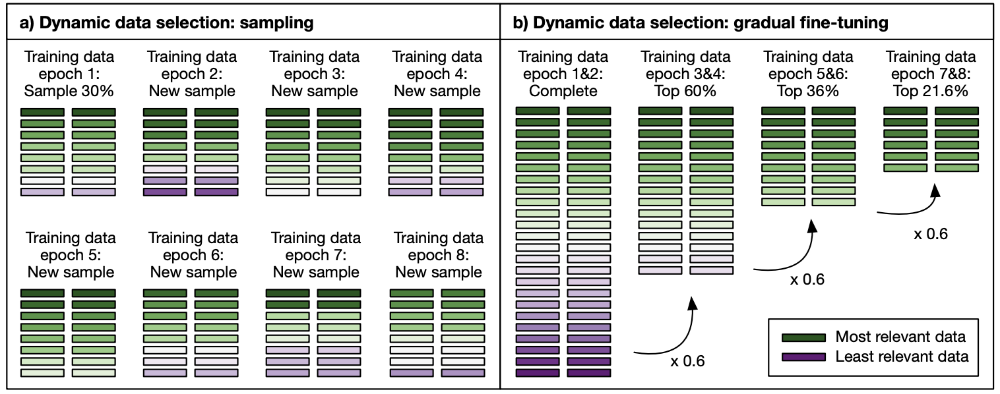

# Research Thesis :mortar_board:

Repositório com artefatos de pesquisa para tese do mestrado em Informática do PPGI (Programa de Pós Graduação em Informática) da Universidade Federal da Paraíba.

## Papers :books:

2020 | Exploring Benefits of Transfer Learning in Neural Machine Translation | Tom Kocmi | arXiv | [`PDF`](https://arxiv.org/pdf/2001.01622.pdf)

2020 | Benchmark and Survey of Automated Machine Learning Frameworks | Marc-Andre Zoller, et al. | arXiv | [`PDF`](https://arxiv.org/pdf/1904.12054.pdf)

2019 | Transfer Learning across Languages from Someone Else’s NMT Model | Tom Kocmi, et al. | arXiv | [`PDF`](https://arxiv.org/pdf/1909.10955.pdf)

2019 | AutoML: A Survey of the State-of-the-Art | Xin He, et al. | arXiv | [`PDF`](https://arxiv.org/pdf/1908.00709.pdf)

2019 | Pay Less Attention With Lightweight And Dynamic Convolutions | Felix Wu, et al. | arXiv | [`PDF`](https://arxiv.org/pdf/1901.10430.pdf)

2019 | Multi-Round Transfer Learning for Low-Resource NMT Using Multiple High-Resource Languages | Yang Liu, et al. | ACM | [`PDF`](https://dl.acm.org/doi/abs/10.1145/3314945)

2019 | Hierarchical Transfer Learning Architecture for Low-Resource Neural Machine Translation | Gongxu Luo, et al. | IEEE | [`PDF`](https://ieeexplore.ieee.org/stamp/stamp.jsp?tp=&arnumber=8805098)

2018 | Transfer Learning in Multilingual Neural Machine Translation with Dynamic Vocabulary | Surafel M. Lakew, et al. | arXiv | [`PDF`](https://arxiv.org/pdf/1811.01137.pdf)

2018 | Neural Machine Translation with Dynamic Selection Network | Fei Han, et al. | IEEE | [`PDF`](https://ieeexplore.ieee.org/document/8781050)

2018 | Twitter Sentiment Analysis using Dynamic Vocabulary | Hrithik Katiyar, et al. | IEEE | [`PDF`](https://ieeexplore.ieee.org/document/8722407)

2017 | Dynamic Data Selection for Neural Machine Translation | Marlies van der Wees, et al. | arXiv | [`PDF`](https://arxiv.org/pdf/1708.00712.pdf)

2017 | Google’s Multilingual Neural Machine Translation System: Enabling Zero-Shot Translation | Melvin Johnson, et al. | arXiv | [`PDF`](https://arxiv.org/pdf/1611.04558.pdf)

2017 | Translating Low-Resource Languages by Vocabulary Adaptation from Close Counterparts | Qun Liu, et al. | ACM | [`PDF`](https://dl.acm.org/doi/abs/10.1145/3099556)

2017 | Convolutional Sequence to Sequence Learning | Jonas Gehring, et al. | arXiv | [`PDF`](https://arxiv.org/pdf/1705.03122.pdf)

2017 | Neural Response Generation with Dynamic Vocabularies | Yu Wu, et al. | arXiv | [`PDF`](https://arxiv.org/pdf/1711.11191.pdf)

2017 | A Comparative Study of Word Embeddings for Reading Comprehension | Bhuwan Dhingra, et al. | arXiv | [`PDF`](https://arxiv.org/pdf/1703.00993.pdf)

2017 | Attention Is All You Need | Ashish Vaswani, et al. | arXiv | [`PDF`](https://arxiv.org/pdf/1706.03762.pdf)

2016 | Text Understanding from Scratch | Xiang Zhang, et al. | arXiv | [`PDF`](https://arxiv.org/pdf/1502.01710.pdf)

2016 | Google's Neural Machine Translation System: Bridging the Gap between Human and Machine Translation | Yonghui Wu, et al. | arXiv | [`PDF`](https://arxiv.org/pdf/1609.08144.pdf)

2015 | How to Generate a Good Word Embedding? | Siwei Lai, et al. | arXiv | [`PDF`](https://arxiv.org/pdf/1507.05523.pdf)

2015 | Transfer Learning for Bilingual Content Classification | Qian Sun, et al. | ACM | [`PDF`](https://dl.acm.org/doi/abs/10.1145/2783258.2788575)

## Repositories :octocat:

2020 | Awesome AutoML Papers | @hibayesian | 2.3k | [`GitHub`](https://github.com/hibayesian/awesome-automl-papers)

2020 | Auptimizer | @LGE-ARC-AdvancedAI | 133 | [`GitHub`](https://github.com/LGE-ARC-AdvancedAI/auptimizer)

2020 | TPOT | @EpistasisLab | 6.9k | [`GitHub`](https://github.com/EpistasisLab/tpot)

## Analysis Papers :nerd_face:

Nesse documento iremos abordar 4 (quatro) artigos relacionados ao tema de pesquisa. As palavras chaves utilizadas foram *Dynamic Vocabulary*, *Neural Machine Translation*, *Transfer Learning* e *Statistical Machine Translation*.

Cada *paper* foi dividido em 4 (quatro) subtópicos: **Paper Goals**, **Approach**, **Experiments** e **Results**.

Os artigos escolhidos são apresentadados abaixo ordenado pelo ano de publicação.

|Ano|Título|Autor|Link|
|---|---|---|---|
|2019|Transfer Learning in Multilingual Neural Machine Translation with Dynamic Vocabulary|Surafel M. Lakew, et al.|[`PDF`](https://arxiv.org/pdf/1811.01137.pdf)|
|2017|Dynamic Data Selection for Neural Machine Translation|Marlies van der Wees, et al.|[`PDF`](https://arxiv.org/pdf/1708.00712.pdf)|
|2019|Multi-Round Transfer Learning for Low-Resource NMTUsing Multiple High-Resource Languages|Yang Liu, et al.|[`PDF`](https://dl.acm.org/doi/abs/10.1145/3314945)|

### 1. Knowledge

#### 1.1. Neural Machine Translation (NMT)

#### 1.2. Transfer Learning (TL)

#### 1.3. Statistical Machine Translation (SMT)


### 2. Hierarchical Transfer Learning Architecture for Low-Resource Neural Machine Translation

#### Authors

Surafel M. Lakew, Aliia Erofeeva, Matteo Negri, Marcello Federico e Marco Turchi

#### Abstract

We propose a method to  **transfer knowledge**  across neural machine translation (NMT) models by means of a shared  **dynamic vocabulary**. Our approach allows to extend an initial model for a given language pair to cover new languages by  **adapting its vocabulary as long as new data become available**  (i.e., introducing new vocabulary items if they are not included in the initial model). The parameter transfer mechanism is evaluated in two scenarios: i) to adapt a trained single language NMT system to work with a new language pair and ii) to continuously add new language pairs to grow to a multilingual NMT system. In both the scenarios our goal is to improve the translation performance, while minimizing the training convergence time. Preliminary experiments spanning five languages with different training data sizes (i.e., 5k and 50k parallel sentences) show a significant performance  **gain ranging from +3.85 up to +13.63 BLEU**  in different language directions. Moreover, when compared with training an NMT model from scratch,  **our transfer-learning approach**  allows us to reach higher performance after training up to 4% of the total training steps.

#### 2.1. Paper Goals

Explorar técnica de *Transfer Learning* para o problema de **Multilingual Neural Machine Translation** utilizando vocabulário dinâmico (e.g German para English, Italy para English). 

<p align="center">
  
</p>

Basicamente a ideia é trabalhar como o *Google Translate* porém com um vocabulário reduzido.

#### 2.2. Approach


Os autores do artigo apresentam duas estratégias de treinamento chamadas *progAdapt* e *progGrow*.

1. **progAdapt** - Treina uma cadeia sequencial de redes transferindo os parâmetros de um modelo inicial L<sub>1</sub> para uma novo par de linguagem L<sub>2</sub> até L<sub>n</sub>. (source ⇔ target para cada L)
2.  **progGrow** - Progressivamente introduz um novo par de linguagem ao modelo inicial. (source → target para cada L)

Para o **Vocabulário Dinâmico**, a abordagem simplesmente mantém a interseção (mesmas entradas) entre as novas entradas e a do treinamento anterior. No momento do treinamento, essas novas entradas são inicializadas aleatoriamente, enquanto os itens que já se encontravam no vocabulário mantém seu peso (*Word Embedding*).
 
O exemplo utilizado abaixo foi utilizando a linguagem **Python** com framework **Pytorch**.

No primeiro caso base temos um vocabulário inicial com apenas 2 (duas) palavras.

```python
word2index = {"hello": 0, "world": 1}
embeds = nn.Embedding(2, 5) # 2 words in vocab, 5 dimensional embeddings
```
Vamos supor que queremos adicionar a palavra `keyboard` ao nosso dicionário, de acordo com abordagem apresentada, nos matemos os pesos de `hello` e `world` e inicializamos `keyboard` aleatoriamente.

```python
word2index = {"hello": 0, "world": 1, "keyboard": 2} # updated vocabulary
concat_embeds = torch.FloatTensor([
    hello_embed.detach().numpy()[0], # old embed
    world_embed.detach().numpy()[0], # old embed
    np.random.rand(5) # new embed initialized randomly
])
embeds = nn.Embedding.from_pretrained(concat_embeds) # 3 words in vocab, 5 dimensional embeddings
```

#### 2.3. Experiments

Com o objetivo de avaliar as duas abordagens apresentadas, os autores implementaram dois modelos bases para teste. O primeiro modelo **Bi-NMT** é treinado do zero para cada conjunto L (source ⇔ target). O segundo modelo **M-NM** concatena o conjunto de todos os pares de linguagem L<sub>1</sub> ... L<sub>n</sub> e também é treinado do zero.

A imagem abaixo apresenta o conjunto de pares de linguagens utilizadas para o treinamento.

<p align="center">
  
</p>

#### 2.4. Results


### 3. Dynamic Data Selection for Neural Machine Translation

#### Authors
Marlies van der Wees, Arianna Bisazza e Christof Monz

#### Abstract

Intelligent **selection of training data** has proven a successful technique to simultaneously increase training efficiency and translation performance for **phrase-based machine translation (PBMT)**. With the recent increase in popularity of neural machine translation (NMT), we explore in this paper to what extent and how **NMT can also benefit from data selection**. While state-of-the-art data selection (Axelrod et al., 2011) consistently performs well for PBMT, we show that gains are substantially lower for NMT. Next, we introduce **dynamic data selection for NMT**, a method in which we vary the **selected subset** of training data between **different training epochs**. Our experiments show that the best results are achieved when applying a technique we call gradual fine-tuning, with improvements up to +2.6 BLEU over the original data selection approach and up to **+3.1 BLEU** over a general baseline.


#### 3.1. Paper Goals

Aplicar técnicas de seleção de dados para **Phrase-based Machine Translation (PBMT)** e **Neural Machine Translation (NMT)** com objetivo de explorar como ambos os modelos (**PBMT** e **MNT**) se beneficiam das mesmas.

#### 3.2. Approach



Os autores do artigo apresentam duas estratégias para seleção de dados, são elas:

1. Static Data Selection - Ordena o conjunto de dados (*corpus*) de acordo com a função de entropia cruzada entre os pares de diferentes conjuntos e seleciona uma parte para o treinamento.

2. **Dynamic Data Selection** - Apresenta 2 (duas) abordagens dinâmicas de seleção de dados, *Sampling* e *Gradual fine-tuning*.

    - **Sampling** - Seleciona uma amostra a cada epoch contendo os pares de sentenças melhores ranqueados.

    - **Gradual fine-tuning** - Gradativamente ao longo das epochs diminui o conjunto de treinamento deixando ao final os dados mais relevantes.

#### 3.3. Experiments

Foram selecionados 4 (quatro) diferentes domínios na forma German → English, analisando as duas abordagens apresentada no item anterior (*Static and Dynamic Data Selection*). 

<p align="center">
  
</p>

#### 3.4. Results


### 4. Multi-Round Transfer Learning for Low-Resource NMT Using Multiple High-Resource Languages

#### Authors

Mieradilijiang Maimaiti, Yang Liu, Huanbo Luan, Maosong  

#### Abstract

**Neural machine translation (NMT)** has made remarkable progress in recent years, but the performance of NMT suffers from a data sparsity problem since large-scale parallel corpora are only readily available for **high-resource languages (HRLs)**. In recent days, **transfer learning (TL)** has been used widely in **low-resource languages (LRLs)** machine translation, while TL is becoming one of the vital directions for addressing the data sparsity problem in low-resource NMT. As a solution, a transfer learning method in NMT is generally obtained via initializing the **low-resource model (child)** with the **high-resource model (parent)**. However, leveraging the original TL to low-resource models is neither able to make full use of highly related multiple HRLs nor to receive different parameters from the same parents. **In order to exploit multiple HRLs effectively**, we present a language-independent and **straight forward multi-round transfer learning (MRTL)** approach to low-resource NMT. Besides, with the **intention of reducing the differences between high-resource and low-resource languages at the character level**, we introduce a unified transliteration method for various language families, which are both semantically and syntactically highly analogous with each other. Experiments on low-resource datasets show that our approaches are effective, significantly outperform the state-of-the-artmethods, and yield improvements of **up to 5.63 BLEU points**.

#### 4.1. Paper Goals

Utilizar a técnica de **Transfer Learning** com múltiplas **High-Resource Language (HRLs)** para **Low-Resource Languages (LRLs)** com objetivo de maximizar o desempenho da tradução e treinamento.

#### 4.2. Approach

Os autores apresentam duas abordagens complementares com objetivo transferir o "conhecimento" aprendido de uma **HRL pai para LRL filha**.

1. **Unified Transliteration** - Observa as similaridades entre as palavras dos pares de linguagem L<sub>3</sub> → L<sub>2</sub> (linguagem pai) e L<sub>1</sub> → L<sub>2</sub> (linguagem filha) para inicialização de θ<sub>L<sub>1</sub> → L<sub>2</sub></sub> (parâmetros relacionados a L<sub>1</sub> → L<sub>2</sub>).

2. **Multi-Round Transfer Learning (MRTL)** - Dado o par de linguagem L<sub>1</sub> → L<sub>2</sub>, podemos inicializar θ<sub>L<sub>1</sub> → L<sub>2</sub></sub> (parâmetros relacionados a L<sub>1</sub> → L<sub>2</sub>) com uma linguagem pai L<sub>3</sub> → L<sub>2</sub> que por sua vez pode ser inicializada outra linguagem L<sub>k+1</sub> → L<sub>2</sub>. Ou seja, uma cadeia de *transfer learning*.

#### 4.3. Experiments

Para os experimentos os autores utilizam a arquitetura **Transformer** presente no framework **PyTorch**.

Os experimentos são feitos levando consideração diferentes iterações de *Transfer Learning* sendo representado **R = N**, onde **N** representa o número de vezes que o processo foi feito.

#### 4.4. Results
